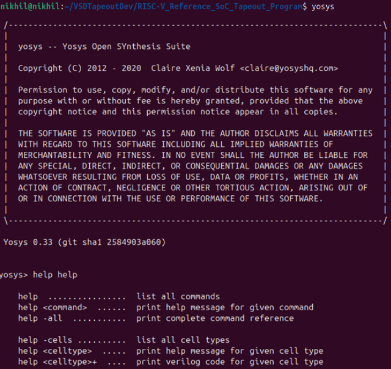
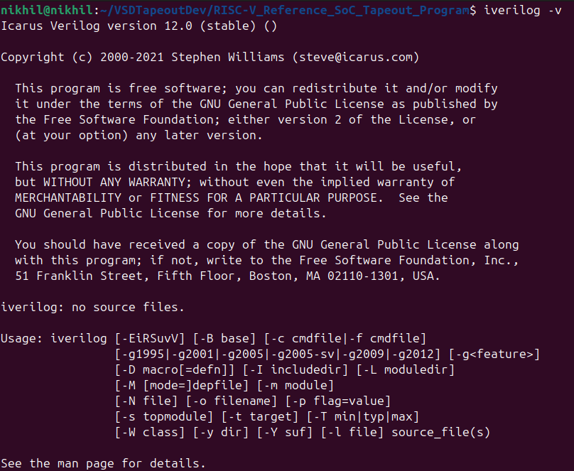
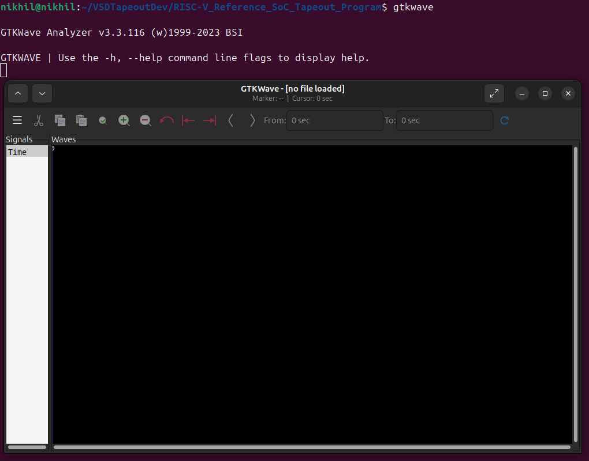

# Week0 Documentation

This repository tracks the **development, training, and tapeout process** of a RISC-V reference SoC, including tool installation, RTL design, synthesis, layout, and post-silicon validation.

---

## Video Summary

### Getting started with Digital VLSI SOC Design and Planning

The goal of chip design is to develop hardware that can reliably execute a specific application. The process begins with validating the application in software: it is compiled using a compiler (e.g., GCC), and the baseline output (O0) is compared with a reference specification (O1). Matching results ensure that the specifications are correctly defined and can serve as a stable starting point.

Next, the hardware is modeled in RTL using Verilog, and its simulated output (O2) is compared to O1. This step confirms that the application will function correctly on the hardware design. Once verified, the RTL is made synthesizable, converting it into a gate-level netlist, integrating macros, and incorporating analog IPs to ensure the design is ready for implementation.

The synthesized components are then integrated into a complete system-on-chip (SoC), forming a microcontroller composed of the processor, macros, and analog IPs. The integrated SoC is simulated, producing output (O3), which is checked against O1 and O2 to ensure the system-level design correctly executes the application.

After successful verification, the final design is converted into a GDSII file and sent for fabrication (tapeout). Once the manufactured chip is received (tapein), the application is run on the physical silicon, producing output (O4). Comparing O4 with O1, O2, and O3 ensures that the final chip performs as intended, confirming the successful completion of the chip design process.

## System Requirements

| Component | Required | My System |
|-----------|---------|-------------|
| RAM       | 6 GB    | 16 GB       |
| Disk Space| 50 GB   | 240 GB      |
| OS        | Ubuntu 20.04+ | Ubuntu 24.04 |
| CPU       | 4 vCPU  | 10 cores / 12 threads      |

## Tools Installation

### 1. Yosys (RTL Synthesis)

Yosys is an open-source synthesis tool for Verilog designs.

```bash
git clone https://github.com/YosysHQ/yosys.git
cd yosys
git submodule update --init --recursive

# Install dependencies
sudo apt-get install build-essential clang lld bison flex libfl-dev \
    libreadline-dev gawk tcl-dev libffi-dev git \
    graphviz xdot pkg-config python3 libboost-system-dev \
    libboost-python-dev libboost-filesystem-dev zlib1g-dev

# Build and install
make config-gcc
make
sudo make install
```

### 2. Icarus Verilog

Icarus Verilog is an open-source Verilog simulator used for compiling and simulating Verilog designs.

```bash
sudo apt-get update
sudo apt-get install iverilog
```


### 3. GTKWave

GTKWave is a waveform viewer used to visualize simulation outputs from Verilog or VHDL designs.

```bash
sudo apt-get update
sudo apt-get install gtkwave
```

## Tools Check

### 1.Yosys



### 2.Icarus Verilog



### 3.GTKWave

